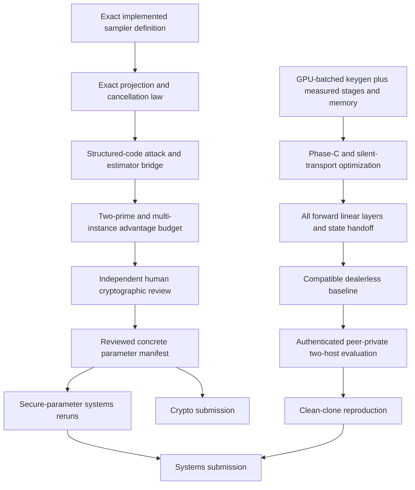

# Ring-LPN publication portfolio — two-track decision

**Date:** 2026-08-04
**Status:** internal/advisor; neither paper is submission-ready
**Authorship:** Alp remains the sole current paper/checkpoint author. Substantive future theorem development or private-project reuse requires an explicit credit/coauthorship decision before circulation.

## Decision

Pursue exactly two theses. Do not split the current GPU-DPF work into a third paper: the deployed primitive is inherited, the current published frontier includes programmable and multi-point DPFs, no general GPU-side distributed-keygen result or speedup is yet established, and ownership overlaps the private PCG/PIM project.

The source-pinned [native-ring technology audit](native_ring_technology_audit_2026_08_04.md) is an internal/advisor **NO-GO** for both tracks: the artifact is centralized, unrevalidated after the 2026 QA-SD attack, scalar-only, and not Orca-integrated. Its future $1\times1$ oracle is strictly toy/correctness-only and does not create a third publication path.

The [structured attack audit](structured_attack_audit_2026_08_04.md) is the
binding attack-inventory starting point for Paper B. It proves only the
negacyclic/cyclic orbit and an explicit stabilizer-event bound, not a generic
square-root decoder speedup or concrete security. Its accepted-estimator,
regular-ISD, AGB and other rows remain random-code/model estimates until the
listed structured-code reductions and independent human review close.

The [closest DMPF baseline audit](closest_dmpf_baseline_audit_2026_08_04.md)
supersedes, but preserves as history, the 2026-07-29 claim that Reverse Cuckoo
had no public code. Newly public
`osu-crypto/libOTe:dmpf@edb5d32822eabf2dda9f6844d85d0ce2e402cdd5`
is rank 1 because it is the closest distributed, setup-capable implementation.
It is not zero-change exact, GPU, or setup-inclusive evidence: the stock runner
uses a mismatched field, internally sampled factors, a native 16-folded layout,
CPU expansion, and synthetic base correlations. Publication comparison requires
caller factors, exact `p0`, a correct 62-bit coefficient context, live
`genBaseCors`, duplicate accumulation, and separately labelled raw 31-diagonal
versus native-folded layouts.

The companion [stock-run report](libote_reverse_cuckoo_stock_baseline_2026_08_04.md)
records the required `-bench` dispatch at the nominal target: 12.43-s process
wall, 22,939,444-KiB peak RSS, 11-s printed internal total, and 446.448-ms
synthetic `setBase`. Live `genBaseCors` was excluded. This is measured closest-
stock evidence under the mismatches above, not a speedup row or a completed
functionality-compatible publication baseline.

The separate [`p0` adapter result](reverse_cuckoo_p0_baseline_2026_08_04.json)
now closes the exact field, caller-factor, 62-bit-context, live-setup,
collision-accumulation, and full-domain correctness gates for libOTe's explicitly
labelled **native 16-folded** layout. It records 18,832,990 us setup,
2,070,844 us online full-domain evaluation, and 20,948,042 us end-to-end
including validation. It does not close the raw 31-diagonal or GPU gate; its
speedup and security claims are null, so it creates no ratio against the
project's raw-layout GPU path.

## Paper A — systems

### Thesis

A live, party-separated GPU preprocessing system maps dealerless Ring-LPN PCG output into Orca's exact forward-linear key ABI and validates it through Orca's unchanged online consumer. The contribution is the composition, GPU/system design, deployment boundary, and evaluation—not Ring-LPN, DPF, OT/OLE, conversion, Beaver multiplication, or Orca.

### Current evidence

- Real two-process SCI/IKNP/Gilboa distributed DPF setup with private CSPRNG
  roots and GPU-batched full-width AES expansion.
- Party-local GPU Ring-LPN expansion on distinct GPUs.
- Exact two-party `Z_Q -> Z_(2^bw)` conversion.
- Persistent consume-once correlation claims, current versioned party records,
  and ten focused duplicate/restart/reuse/collision/truncation/record controls.
- Current ResNet18 classifier shape `1x512x1000`, q128/bw32 feasibility run:
  10/10 measured trials after one warmup, 25.715-s median preprocessing,
  575,846,872 application bytes total, 10.642-ms matched stock dealer median,
  and 1.106-ms unchanged two-share online checker median. It records 10,338
  dependency stages, peak host/GPU memory, and the exact `(c-1)n` public tail.
- Representative generalized Conv2D q64/q128 smoke cases and focused
  EMP-Silent full-loopback/FC/Conv correctness gates pass.

These are current negative feasibility measurements, not a performance win,
full-model result, authenticated deployment, or security-level result.
q64/q128 denote one/two approximately 62-bit limbs, not security levels.

### Submission gates

1. Consume a reviewed concrete parameter manifest from Paper B; rerun every headline row at that exact tuple.
2. Authenticate both SCI `NetIO` streams end to end and bind peer identity, both ports, SID, manifest, and executable digest. Raw WAN TCP is prohibited.
3. Enforce separate OS/container/host identities and party-private roots; checker access begins only after both parties exit.
4. Replace or restructure the measured tree-per-point Phase-C bottleneck with
   a source-reviewed DMPF/P-DPF design while preserving exact stock-key output.
5. Measure and independently review the existing EMP-Silent route; either
   establish its exact security/setup/bandwidth boundary or retain SCI/IKNP as
   the explicit negative result.
6. Cover every forward FC and convolution layer of at least one real inference
   model, including exact masks, layout, truncation/state handoff, and unchanged
   online consumers.
7. Recheck dependency-stage counts as actual authenticated-network rounds;
   retain stages, base setup, bytes by stream, peak host RSS, peak GPU memory,
   aborts, and dispersion.
8. Complete a functionality-compatible dealerless PCG/DMPF comparison under
   the [closest-baseline audit](closest_dmpf_baseline_audit_2026_08_04.md).
   The stock and exact-`p0` native-folded Reverse-Cuckoo rows are measured but
   remain mismatched; never ratio them against the raw 31-diagonal GPU path.
9. Run authenticated repeated LAN and controlled-WAN trials on two real hosts. The workstation currently has no configured second SSH host, so this experiment is externally blocked.
10. Reproduce from a clean clone/container with pinned dependency, compiler, CUDA, image, dataset/weight, source, and binary digests; renew human source/proof review after final code changes.

### Venue disposition

Top systems/security venue only after all gates above. Before then, the honest target is an artifact/measurement venue with a negative performance conclusion, not a claimed practical secure-ML speedup.

## Paper B — cryptography and concrete parameters

### Thesis

Repair the concrete-parameter bridge for the regular sparse distribution actually used by a fully split Ring-LPN PCG. The paper must contribute a new theorem, attack, or reviewed parameter methodology—not merely rerun an LPN estimator or report an inconsistency in BCG+20.

### Established starting point

Let `n=B*t`, with one independently uniform position in each contiguous bucket of width `B` for every one of `c` polynomials. For a two-power one-sparse factor degree `d|n`:

- if `d<=B`, each polynomial projects to `t` independent uniform balls in `d` bins;
- if `d=B*k>=B`, each polynomial splits into `k` disjoint intervals, each receiving `t/k` independent uniform balls in `B` bins.

The occupied-support distribution follows an exact integer recurrence and group convolution. Including coefficient cancellation over `F_p`, a state with `z` nonzero bins has one-step integer transition counts over denominator `d*(p-1)` (or the applicable group-bin count):

- `z -> z+1`: `(d-z)*(p-1)`;
- `z -> z-1`: `z`;
- `z -> z`: `z*(p-2)`.

This yields the exact projected nonzero-support law for each deployed prime. Conditional on a fixed realized support/allocation, nonzero bin values are independently uniform in `F_p^*`; a separate proof must connect that entropy to the actual negacyclic block code.

Before projection the exact instance is standard RSD with
`(N,k,w)=(c*n,(c-1)*n,c*t)`, one nonzero per public bucket, and iid uniform
`F_p^*` payloads. After degree-`d` projection it is the exact dependent
occupancy/cancellation distribution, not RSD. The negacyclic instance is
diagonally equivalent to a cyclic one and one public syndrome has an
`n`-element orbit outside the explicit stabilizer event (`d` after projection).
Orbit existence is a data fact; outside Sendrier's concrete Stern scope,
subtracting `0.5*log2(n)` or `0.5*log2(d)` from a decoder remains a heuristic
sensitivity. The corrected local diagnostic uses `d`, not `(c-1)*d`.

### Why BCG+20 does not pin this system

The corrected full version's Section 8.2 uses `c*d*(1-(1-1/d)^t)`. Section 9.1 prints a different expected-weight formula and a criterion that admits degree 16 for `(c,w)=(4,64)`, while Table 1 reports degree 128. The projected code has redundancy `d`; the accepted EUROCRYPT-2024 finite-field estimator is defined only through weight `d-1` because its implementation evaluates `C(N'-k'-1,t')`. That estimator models finite-field exact/regular noise rather than this projected distribution and does not by itself prove the required structured-code mapping.

### Candidate diagnostics, not pins

Exact occupancy and accepted-estimator experiments identify candidate families `(n,c,t)=(2^20,4,32)`, `(2^20,4,64)`, and `(2^20,8,16)`. At the same 16,384 raw DPF-tree count, `(8,16)` has materially stronger finite-field model diagnostics than `(4,32)` but requires four times as many polynomial-pair products and `7/3` as many jointly sampled public polynomial coefficients: `a0` is the unsent identity and only `(c-1)n` coefficients are exchanged. Existing 32-GiB GPU component runs at `n=2^20` memory-failed before measurement because the current allocator reserves 25 GiB and then performs incompatible explicit work allocations. No candidate is selected until the proof and feasibility gates close.

Those generic-estimator candidates were produced before a complete modern
attack comparison. A pinned CRYPTO-2024 regular-ISD transcription now emits
direct Perm/Enum/Rep/RepD2/CCJ diagnostic rows for both primes, but keeps
artifact overflow, unpinned generic-BJMM dependency, unspecified memory units,
q-ary/structured-model transfer, and orbit subtraction as explicit
incompatibilities or assumptions. It is not a pin. A pinned ASIACRYPT-2025
hybrid-RSD Theorem-1 calculator now covers both primes, but it is not an attack
implementation; its full-rank Macaulay heuristic, field-operation/big-O memory
model, structured-code transfer, orbit composition, and concrete byte/bit cost
remain review gates. The 2025/2026 QA-SD compressed-sensing/correlation attacks
at the deployed large prime still need executable dispositions. The
2026 sparse-equation and small-secret attacks require sparse public coefficient
matrices and do not match the current dense multiplication matrices as stated,
but remain recorded rather than silently omitted.

### Submission gates

1. Prove the exact projection and cancellation law for every two-power factor degree, including `d>B`, and machine-check it by exhaustive tiny cases.
2. Prove a lower-tail/conditioning statement for the actual sampler; do not substitute expected weight.
3. Resolve the dense regime `h>=d`, where the accepted estimator is undefined, using a conditional-support rank/leftover-hash theorem for the actual random negacyclic block matrix or a new attack. Do not assume dense projections are harmless.
4. Prove the bridge from the dependent projected distribution to each attack model. Treat AGB, generic ISD, statistical decoding, support recovery, algebraic/Schur-product attacks, and decoder-specific QC/negacyclic one-out-of-many effects explicitly; orbit existence alone is not a reviewed square-root cost transfer.
5. Independently review both source-pinned direct-RSD calculators. Resolve the CRYPTO-2024 transcription's CCJ-overflow, delegated generic-BJMM, memory-unit, q-ary and structured-code incompatibilities. Validate the ASIACRYPT-2025 theorem transcription/optimizer and supply an attack implementation or independently justified concrete execution model, including bit/byte costs for field operations and big-O field-element memory. Record source revision/checksum, distribution/model, exact inputs, orbit treatment, assumptions, peak/total memory, data/preprocessing, success/repetition semantics, and executable provenance. Explicitly disposition the 2025/2026 QA-SD attacks at the large-prime univariate parameters.
6. Audit every useful sparse factor, not one selected degree, and prove why other factors cannot do better.
7. Compose both independent q62 limbs, directions, ring batches, layers, DPF/PRG/OT/OLE hybrids, conversion, and sampler bad events in one advantage budget. Give classical and quantum interpretations separately.
8. Emit deterministic source-pinned parameter tables with estimator domain guards and complete attack-component transcripts. Generic estimator outputs and orbit-adjusted sensitivities must carry `MODEL_DIAGNOSTIC_ONLY`, never a concrete-security label.
9. Obtain independent human cryptographic review. Model-assisted reviews are pre-review only and cannot satisfy this gate.

### Venue disposition

CRYPTO/EUROCRYPT/ASIACRYPT class only if the work delivers a reviewed reduction, attack, or concrete-parameter theorem. Without that result, the honest target is an applied-cryptography analysis/erratum or no standalone paper.

## Shared artifact and disclosure

- One pinned release and environment manifest may support both papers.
- Paper B exports only the sampler specification, reviewed parameter manifest, and proof/attack artifacts; Paper A consumes and cites them.
- Maintain a claim-to-file/table ownership map. Do not count the same table or figure as a separate contribution in both papers.
- Disclose shared code and the common security contract.
- Retain Orca, BCG+20, Doerner--shelat, Programmable DPF, improved DMPF/ARR/SLAMP-FSS, Cheddar, GPU-NTT, SCI, and estimator attribution.
- Treat the baseline audit's author contacts as claim gates: obtain an archival Reverse Cuckoo tag and parameter/API clarification; request Programmable-DPF code and license; resolve SLAMP-FSS code license/duplicate semantics; and clarify the release and GPU-full-domain status of `myl7/fss` VDMPF before external claims.
- Do not import or publish private PCG/PIM code, measurements, figures, or prose without written permission and an explicit contributor-credit decision.
